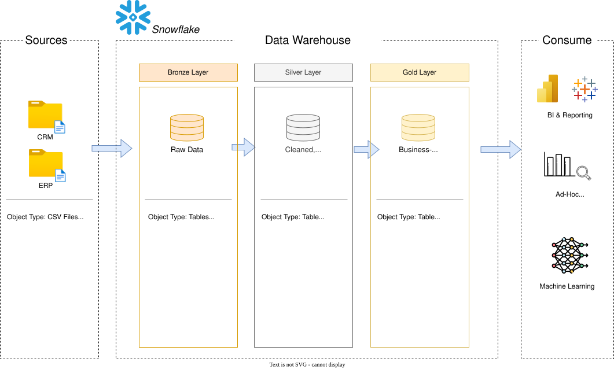

# データウェアハウス(DWH)構築 & データ分析

Snowflakeを用いて、販売データを対象としたモダンなデータウェアハウスを構築する個人プロジェクトです。  
ERP・CRM由来のCSVデータを取り込み、データクレンジング・統合・モデリングを経て、分析に適したデータ基盤を整備することを目指しています。

現在はプロジェクト進行中で、データ基盤の整備と分析用レイヤの構築を進めています。

## このプロジェクトで取り組んでいること

- Snowflake上でのデータウェアハウス構築
- CSVファイルの取り込みとステージング設計
- Bronze / Silver / Gold レイヤを意識したデータモデリング
- データ品質の確認と整形
- SQLによる分析用データセットの整備
- Git連携やコンテキスト設定を含むSnowflake運用の理解

## 🏗️ Data Architecture

データ基盤は、Bronze / Silver / Gold の3層で構成するメダリオンアーキテクチャを採用しています。



- **Bronze**: ERP・CRM由来のCSVデータを、元の形のままSnowflakeに取り込むレイヤ
- **Silver**: データのクレンジング・標準化・統合を行うレイヤ
- **Gold**: 分析やレポート向けに、スタースキーマのデータモデルを提供するレイヤ

## プロジェクト概要

### 目的

Snowflakeを使ってデータウェアハウスを構築し、販売データを統合することで、分析レポートや情報に基づいた意思決定を可能にすることを目的としています。

### 対象データ

- **データソース**: CSVファイルとして提供されるERP・CRMの2系統データ
- **重視する点**: 分析前段階としてのデータ品質改善、不整合の修正、正規化
- **統合方針**: 複数ソースを統合し、分析クエリに適した単一のデータモデルへ整理
- **スコープ**: 現時点では最新データを対象とし、履歴管理は扱わない

### 分析テーマ

SQLベースで、主に以下の観点から分析できる状態を目指しています。

- **顧客行動**
- **商品パフォーマンス**
- **販売トレンド**

## Snowflakeで進めている理由

元の教材ではSQL Serverが利用されていますが、このリポジトリではSnowflakeを採用しています。  
単なる置き換えではなく、Snowflakeの基本的な運用や設計を理解しながら進めることを意識しています。

現時点では、以下のような内容を扱っています。

- データベース、スキーマ、ウェアハウス、ロールの利用
- ステージ作成とファイル取り込みの流れ
- `USE ROLE`、`USE WAREHOUSE`、`USE DATABASE` などのコンテキスト設定
- SnowflakeとGitの連携を意識した開発

## 元教材との差分

このプロジェクトは、Baraa Khatib Salkini氏のUdemy講座  
「Building a Modern Data Warehouse - Data Engineering Bootcamp」を参考に進めています。

参考元:
https://www.udemy.com/course/building-a-modern-data-warehouse-data-engineering-bootcamp/

ただし、本リポジトリでは以下の点で自分なりに置き換え・学習を進めています。

- 実装環境をSQL ServerからSnowflakeへ変更
- Snowflake向けのデータベース/スキーマ構成で構築
- Snowflake特有のステージやコンテキスト管理を含めて実装
- 学習記録ではなく、再現可能なデータ基盤プロジェクトとして整理

## リポジトリの構成

```text
snowflake-dwh-lab/
├── datasets/                          # 取り込み元のCSVデータ
│   ├── source_crm/                    # CRMデータ（顧客・商品・販売）
│   └── source_erp/                    # ERPデータ（顧客・地域・商品カテゴリ）
├── docs/                              # 設計資料・セットアップ手順
│   ├── data_architecture.drawio.svg   # データアーキテクチャ図
│   ├── data_flow.drawio.svg           # データフロー図
│   ├── data_integration.drawio.svg    # データ統合図
│   ├── data_model.drawio.svg          # データモデル図
│   ├── data_catalog.md                # データカタログ
│   ├── naming_conventions.md          # 命名規則
│   ├── setup-git-workspace.md         # SnowflakeとGitの連携手順
│   └── setup-keypair-auth.md          # キーペア認証の設定手順
├── scripts/                           # Snowflake向けのSQLスクリプト
│   ├── bronze/                       # 生データのテーブル定義・取り込み
│   ├── silver/                       # クレンジング・変換処理
│   ├── gold/                         # 分析用データモデルの定義
│   ├── init_databases.sql             # データベース・スキーマの初期設定
│   └── init_stage.sql                 # ステージの初期設定
├── tests/                             # データ品質チェック用SQL
│   ├── quality_checks_silver.sql
│   └── quality_checks_gold.sql
├── README.md                          # プロジェクト概要
└── LICENSE                            # ライセンス
```

## ライセンス

本リポジトリは[MITライセンス](LICENSE)の下で公開されています。
